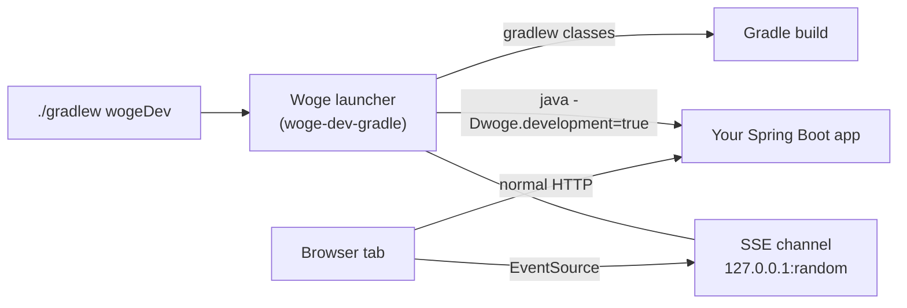

# Development lifecycle and reload model

Woge treats the development loop as a small state machine, not as text printed by Gradle or a server.
That gives a browser, command-line tool, Gradle task and future IDE integration the same answer to
questions such as “is the current build valid?” and “does this edit need a refresh or a restart?”.

The implemented model lives in the internal `woge-dev-model` module. It contains no Spring, Ktor,
Gradle, Vite, browser or MCP types. Those systems will be adapters around the model.

## What happens after an edit

1. A watcher reports `BuildStarted` with a new monotonic `BuildId` and semantic changes.
2. A newer save supersedes the in-flight build. Its changes are coalesced into the newest build.
3. `BuildSucceeded` selects the cheapest reload level that has been proven correct, or
   `BuildFailed` publishes structured diagnostics.
4. Browser-facing updates end with `ReloadApplied`; server-facing updates use
   `ServerRestarting` and `ServerReady` with a new monotonic `ServerGeneration`.
5. Events for an older build or server generation cannot mutate current state.

A compile failure does not tear down the last valid application. The failed build and its diagnostics
become visible while the previous ready server generation and URL remain available. A late success
from a cancelled or superseded build is rejected.

## Reload levels

The order is a correctness fallback chain:

1. `HOT_ASSET` updates an independently safe asset such as CSS.
2. `HOT_FRONTEND_MODULE` replaces an eligible frontend module while retaining page state.
3. `DOCUMENT_REFRESH` asks the browser for a new document.
4. `SERVER_RESTART` starts a new application generation in the existing development host.
5. `COLD_RESTART` recreates the complete development process boundary.

Tooling may move to the right whenever a cheaper action is unsupported or uncertain. It may move to
the left only with evidence that the edit is safe at that level. This makes reload an optimization;
correct behavior never depends on hot updating successfully.

## First Spring Boot topology

Woge owns the development session, build outcomes, structured state, browser channel and Spring Boot
child process. Spring DevTools is only the fast restart adapter for the canonical Spring host:

1. Gradle compiles while the last valid child keeps serving.
2. A compile failure publishes diagnostics and does not request a restart.
3. A successful ordinary Kotlin or generated-source build updates the DevTools trigger file. The
   build includes the Woge KSP processor, so new or changed `@WogeRegion` functions regenerate
   their descriptors first. A compile error in generated code triggers one full regeneration
   ([ADR 0050](../adr/0050-ksp-inside-wogedev.md)).
4. DevTools replaces its restart classloader inside the same child JVM.
5. Woge observes readiness and publishes the new build and server generation to browsers.

Unsafe changes, build configuration and DevTools incompatibilities fall back to complete child
replacement. Woge stops the valid child only after a successful build, then reuses the explicit
loopback application port. This creates a short server gap during the fallback; the current browser
document remains visible and refreshes only after the replacement is ready.

The browser lifecycle channel uses Server-Sent Events from a stable loopback orchestrator endpoint.
It is downstream-only and carries monotonic identity so clients can reject stale events and reconnect.
Commands remain on separately authorized boundaries. M1 does not add a reverse proxy: the normal
DevTools path already preserves the process and port, and the measured fallback gap does not justify
proxy routing yet.

The executable comparison and measurements are in the
[Spring Boot reload topology evidence](https://github.com/christian-draeger/woge/blob/8f9f92e22fab2ecaa1e7a205466949f2bea11a1b/spikes/spring-boot-reload-topology/evidence.md). The
durable process and transport decision is [ADR 0041](../adr/0041-orchestrator-owned-spring-reload-and-sse-channel.md).

The terms used by Woge are deliberately precise:

- **Live Reload** rebuilds and then refreshes the document. Browser state may be lost.
- **Hot Restart** replaces the running server application generation and synchronizes the browser;
  it does not redefine loaded JVM classes.
- **HMR / Hot Update** replaces a proven-safe asset or frontend module without a full document load.
- **True JVM Hot Reload** redefines classes in a live JVM. It is not part of the first Woge release.

## One capability boundary

`WogeDevelopmentCapabilities` exposes structured operations for status, bounded await-build,
diagnostics, reload, restart, the application manifest and local development URLs. CLI output and a
browser overlay render this model; they do not scrape each other. Gradle, Spring Boot, Ktor, optional
Vite, MCP, tests and future IDE support remain replaceable adapters.

The application manifest has only a minimal interface here. Its concrete, versioned and non-secret
schema belongs to [issue #146](https://github.com/christian-draeger/woge/issues/146).

## The orchestrator

`woge-dev-orchestrator` turns file edits into the events above. It is plain Kotlin with coroutines
and knows nothing about Gradle, Spring or Ktor. You plug in four small adapters:

| Adapter | Job |
| --- | --- |
| build | Compile and report success or diagnostics |
| host | Start, restart and stop the application child process |
| frontend | Apply a hot CSS or module update, or say "not possible" |
| manifest | Provide the application manifest for the last good build |

Rules in short (details in [ADR 0042](../adr/0042-single-actor-development-orchestrator.md)):

- A newer edit cancels a running build. Old results are never shown.
- A running restart finishes first; later edits become one new build.
- If a failed build is fixed by a CSS-only edit, the server still restarts, because Kotlin changed.
- Fallbacks go up, never down: hot update, document refresh, server restart, cold restart.
- If even the cold restart fails, the phase is `SERVER_FAILED`. The previous app keeps running only
  when the host says so.
- `reload` and `restart` commands only work for the latest successful build.

## The Spring Boot host

`woge-dev-spring-host` is the first host adapter ([ADR 0043](../adr/0043-spring-dev-host-uses-log-marker-and-trigger-file.md)).
It starts your app as a child process and has two ways to restart it:

- **Fast:** after a successful build, write the trigger file. Spring DevTools restarts inside the
  running JVM.
- **Complete:** stop the process, check the port, start a new one. Always correct, a bit slower.

"Ready" means Spring has finished startup, including application runners, and the development listener
has acknowledged the current restart token. A normal startup log or an old token is not enough.
The trigger file must be in the application's classes/resources directory; Woge creates it before
starting the child. The development launcher adds the readiness listener to the child classpath,
binds Spring to `127.0.0.1`, and disables Spring's separate LiveReload server.

If the port is taken, the process exits or nothing is ready in time, you get a short diagnostic code
(`SPRING-HOST-*`), never raw output. Three failed starts in a row add `SPRING-HOST-CRASH-LOOP`.
An unexpected exit after readiness clears the dead generation and its URLs. Save again to rebuild
and restart. Cancelling the session stops the child and its descendants.

## The browser channel

`woge-dev-browser` serves plain JavaScript, normal CSS and a stable SSE endpoint from the orchestrator
process. It keeps running while the application child restarts. There is no reverse proxy, and you do
not need Node/Vite to use it.

Pages get the client in one of two explicit ways. `wogeDev` adds it to every document `head`
automatically (see below). A tool that runs the channel in the same process can call
`HtmlWriter.developmentClient(channel, renderedBuild, generation)` inside the head itself. These IDs describe the application that rendered the page, not a newer
build that is still starting. This uses Woge's typed HTML DSL, not hand-built markup. It adds an
external script; set `overlay = false` to omit the status panel and its stylesheet.

Strict Content Security Policies keep working under `wogeDev`. If the page gives one of its own head
assets a nonce (`moduleScript`, `stylesheet` or `style`), the client reuses that nonce. A dev-only
Spring filter adds the channel origin to `script-src`, `style-src` and `connect-src` of the app's
`Content-Security-Policy` header, for MVC and WebFlux. Nothing else in the policy changes, and no
production policy is relaxed, because the filter lives in a `developmentOnly` module. See
[ADR 0046](../adr/0046-development-client-under-strict-csp.md).

Every tab has its own native `EventSource` connection. Snapshots show rebuilding, restarting, ready
or failed, with concise source-located diagnostics. A reconnect gets the current snapshot, including
the last ready build, rather than replaying every old edit. Stale IDs cannot trigger a refresh.
Offline tabs keep their document and reload only after coming online.

A failed compile does not refresh or edit the document. After a successful restart, each tab
refreshes once when its rendered build/generation is older than the ready app. A full refresh does
**not** promise to preserve dirty controls, scroll or focus; that follow-up is #150. The optional
overlay never moves focus and can be hidden with a normal button. A privileged raw-detail link
appears only if a build adapter explicitly supplies detail output; raw logs are not the protocol.

See [ADR 0044](../adr/0044-development-browser-snapshots-and-explicit-opt-in.md) for identity, reconnect
and connection-budget rules.

## The `wogeDev` command

`./gradlew wogeDev` is the normal way to work on a Spring Boot application. The Gradle plugin
`dev.woge.spring-boot` registers it. It starts one small launcher process that owns everything else:

1. The launcher watches `src/**` and polls for changes. Saving several files quickly starts one build.
2. It runs `./gradlew classes resolveMainClassName` for the application project. Errors stay in the
   terminal and the overlay with file, line and column; the old app keeps serving.
3. After a successful build it touches the Spring DevTools trigger file. If DevTools does not report
   ready in time, it starts a new app process (the correctness fallback).
4. The app reads the current SSE address from a small properties file. Woge core adds the client
   markup to every `head`, but only when the JVM runs with `-Dwoge.development=true`.
5. Changes to `build.gradle.kts`, `settings.gradle.kts` or the version catalog are reported. Restart
   `wogeDev` after changing dependencies.

`./gradlew wogeTasks` lists the supported tasks (`wogeDev`, `check`, `bootJar` and more) with their
options. `./gradlew wogeTasks --format=json` prints the same list as JSON for coding agents. Both come
from one list in the plugin, which also provides the normal Gradle task descriptions.

Production stays clean: the dev modules and DevTools are `developmentOnly`, which `bootJar` excludes,
and `verifyWogeProductionArtifact` (part of `check`) fails the build if they appear in the jar anyway.
See [ADR 0045](../adr/0045-wogedev-gradle-launcher-and-development-head-hook.md).

## Security and production isolation

- Development URLs accept loopback HTTP(S) hosts only and cannot contain credentials, query values or
  fragments.
- Diagnostics contain stable codes, redacted one-line summaries and optional repository-relative
  positions. Raw terminal output, exceptions, environment values and absolute workstation paths are
  not model fields.
- A capability implementation is privileged. Any network adapter must bind locally by default and
  authenticate and authorize callers before exposing reads or invoking reload/restart commands.
- `woge-dev-model` is internal and unpublished. The module graph rejects dependencies from production
  roles, and the Spring Boot starter verifies that no `woge-dev-*` artifact reaches its runtime classpath.
- Production packaging must contain no development endpoint, watcher, token, manifest endpoint or
  tooling resource. A disabled runtime switch is not sufficient isolation.

Node/Vite is optional, not a requirement for Kotlin-and-CSS applications. When an application picks
Vite, `wogeDev` runs it as one more child process: Vite hot-updates its own modules, while Woge
alone reloads the page after server changes. Kotlin sources are never Vite inputs
([ADR 0070](../adr/0070-optional-direct-vite-frontend-adapter.md)). A stable public MCP API is
also deferred until the underlying capabilities have real adapter experience.

The durable decision and rejected alternatives are recorded in
[ADR 0038](../adr/0038-build-independent-development-lifecycle.md) and
[ADR 0041](../adr/0041-orchestrator-owned-spring-reload-and-sse-channel.md).
