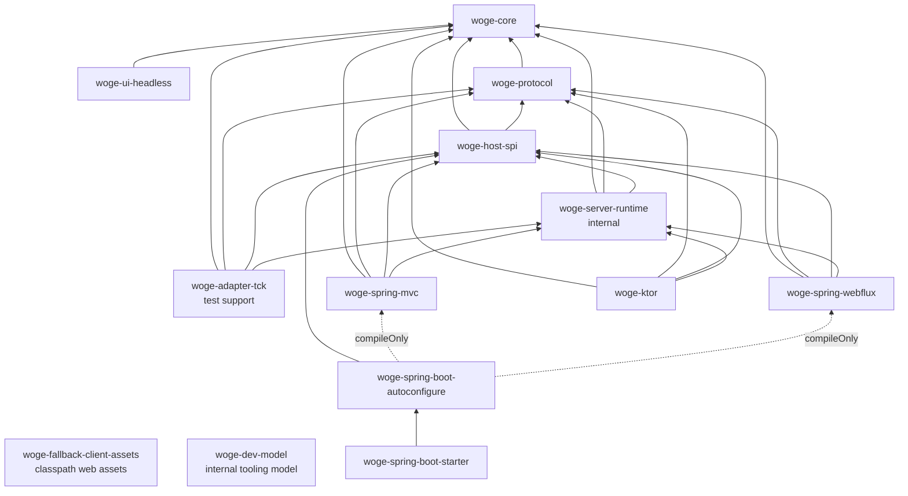

# M1 module and consumer graph

Woge keeps portable web concepts at the center and translates them at the outer edges. The build reads
the production JVM projects and allowed dependencies from
[`module-boundaries.tsv`](../../config/architecture/module-boundaries.tsv). [ADR 0019](../adr/0019-materialized-m1-module-boundaries.md)
owns the current boundary decision.

Arrows point from a consumer to what it may depend on. MVC, WebFlux and Ktor are peers. In particular,
the Spring adapters cannot depend on each other, and Ktor never wraps Spring concepts.

## What lives where

| Concern | Owner | Why |
| --- | --- | --- |
| HTML writer and familiar HTML DSL | `woge-core` | HTML is the central application-facing web API |
| Accessible behavior without styling | `woge-ui-headless` | Components stay portable across hosts and CSS choices |
| Patch and streaming values | `woge-protocol` | Hosts share one versioned wire vocabulary |
| Page/action/live use cases | `woge-host-spi` | Application code sees Woge-owned ports, not server requests |
| Shared execution machinery | `woge-server-runtime` | Adapters reuse implementation without making it public API |
| Development lifecycle semantics | `woge-dev-model` | Tool adapters share ordering and fallback rules without entering production artifacts |
| Adapter parity fixtures | `woge-adapter-tck` | Every host proves the same observable contract |
| Spring Boot setup | auto-configuration and starter | Spring is first-class without becoming the core abstraction |
| Browser patch application | npm `@woge/fallback-client` | It is a small web artifact, not a JVM or component runtime |
| Browser assets without a Node application build | `woge-fallback-client-assets` | A framework-neutral classpath adapter serves the same canonical ES modules |
| Multi-host proof | [`examples/reference-application`](../../examples/reference-application/README.md) | It consumes public artifacts and never becomes their dependency |

## Deferred boundaries

- `woge-html-kotlinx` remains an optional future interop artifact; `kotlinx.html` types do not enter core.
- WebSocket transport remains a future protocol/host adapter after a concrete transport contract exists.
- Kotlin/JS and Kotlin/Wasm remain optional local-island choices, not application-wide runtimes.
- CSS scoping, Tailwind build integration and the source-component registry remain build tooling, not
  server or browser runtime dependencies.

The two browser distribution paths are defined in
[ADR 0036](../adr/0036-dual-fallback-client-distribution.md). They are alternatives for installing
the same runtime, not separate implementations: npm supplies a bundled ES module for frontend asset
pipelines, while the JVM artifact supplies canonical unbundled modules as classpath resources.

The boundary validator fails on missing modules, unknown or cyclic edges, Gradle/manifest drift,
forbidden host references in portable production source and MVC/WebFlux cross-dependencies. Negative
fixtures also prove that production modules cannot depend on the isolated development model. Run both layers directly with
`./gradlew validateModuleBoundaries testModuleBoundaries` or as part of `./gradlew check`.

The executable contract and current host coverage live in the
[server-adapter parity matrix](server-adapter-parity.md). Adapter tests depend on the TCK only in
their test source sets; production adapters remain peers and never depend on one another.
