# Woge threat model

This living document turns Woge's web-native architecture into concrete security assumptions, defaults and test ownership. It covers the M1 core work and the planned server adapters, generated descriptors, streamed patches and browser runtime. The current implementation is not yet a deployable application stack.

Last review: 2026-09-04.

## Scope and assumptions

Woge must remain safe when route/form/header/cookie values, stored application data and rendered user text are hostile. A response originating from the application server is not proof that every value used to render it was trustworthy.

The deployment owner is responsible for TLS termination, host/proxy configuration, secret storage, dependency updates, authentication choice and domain authorization rules. Woge integrates those facts but is not a web application firewall, identity provider or general-purpose sanitizer. Framework authentication or a generated action registry never implies that the current principal may perform a domain operation.

An attacker who already executes arbitrary script in the application's origin can usually act with that user's authority. CSP, Trusted Types-compatible sinks and inert patch parsing reduce exposure, but output encoding and authorization remain primary controls.

## Assets and actors

Protected assets include:

- application/domain data and mutations;
- authenticated identity, capabilities, session and CSRF material;
- generated page/action registries and route contracts;
- rendered HTML, patch payloads, live events and their ordering metadata;
- the active page epoch, region identities, revisions, dirty form state and focus;
- availability of server render work, stream buffers and browser parsing;
- diagnostics, correlation data and configuration secrets;
- source-distributed components, browser modules and build-generated artifacts.

Actors are anonymous and authenticated users, a cross-site attacker, a malicious or compromised content author, an application developer, Woge/server-adapter code, reverse proxies/CDNs, the browser runtime and optional third-party component/island code. Library and application code are trusted at build time but can be mistaken or compromised; persisted content and every browser request remain untrusted.

## Data flow and trust boundaries

```mermaid
flowchart LR
    B[Browser and other HTTP clients] -->|untrusted URL, headers, cookies, form/body| H[Spring MVC, Spring WebFlux or Ktor adapter]
    H -->|decoded Woge calls and verified security facts| U[Woge use-case ports]
    U --> A[Application and domain authorization]
    A -->|models may contain hostile stored data| R[HTML and Patch IR rendering]
    R -->|framed bytes over HTTP/SSE| P[Proxy and network]
    P -->|arbitrary byte chunks| C[Browser frame parser]
    C -->|validated metadata and inert HTML| T[Active-page target registry]
    T --> D[DOM, focus and live regions]
```

The numbered trust boundaries are:

1. **Client to host adapter:** all request data, action IDs, resume cursors and client-reported revisions are untrusted. The adapter applies size limits, framework security and typed decoding.
2. **Host adapter to Woge port:** adapters translate authenticated facts and CSRF outcome into Woge-owned values. Raw request/session/security objects do not enter portable code.
3. **Use case to domain:** generated registration proves callability, not authorization. The use case authorizes the principal and resource for every operation and subscription.
4. **Model to renderer:** stored and computed strings are untrusted by default. The output context determines escaping; raw HTML crosses an explicit auditable boundary.
5. **Encoder to browser parser:** compression, proxies and network reads can split or combine bytes arbitrarily. Framing, metadata and resource limits are validated before DOM application.
6. **Parser to target registry:** target IDs, page epochs, revisions and protocol versions must match the active document. They never become arbitrary CSS selectors or authorization capabilities.
7. **Patch to DOM:** patch markup is inert by default. Scripts, inline event handlers and active URL schemes do not become executable through ordinary patch application.
8. **Failure to diagnostics:** client-visible errors reveal a correlation ID and safe category, not stack traces, tokens, cookies, submitted secrets, raw HTML or authorization detail.
9. **Extension/build boundary:** raw-HTML helpers, host escape hatches, source-owned components and local islands are explicit trusted code dependencies and cannot silently weaken defaults.

## Threats, controls and test ownership

| ID | Threat and attack | Required default/control | Verification owner |
| --- | --- | --- | --- |
| WOGE-XSS-001 | Hostile text closes an element/attribute or injects markup | Context-aware text and quoted-attribute encoding; typed URL handling; hostile Unicode fixtures | [#16](https://github.com/christian-draeger/woge/issues/16), [#42](https://github.com/christian-draeger/woge/issues/42) |
| WOGE-XSS-002 | Raw HTML or a patch introduces script, `on*` handlers or active URLs | Raw HTML requires an explicit unsafe/trusted value; ordinary patches reject executable elements/attributes and dangerous URL schemes; no `eval` or inline runtime requirement | [#16](https://github.com/christian-draeger/woge/issues/16), [#21](https://github.com/christian-draeger/woge/issues/21), [#42](https://github.com/christian-draeger/woge/issues/42), [#43](https://github.com/christian-draeger/woge/issues/43) |
| WOGE-CSRF-001 | A cross-site request triggers a native or enhanced mutation | Unsafe methods fail closed without adapter-verified CSRF; forms and enhanced requests carry the same token; SameSite cookies and Fetch Metadata may add defense in depth, not replace a token where required | [#30](https://github.com/christian-draeger/woge/issues/30), [#31](https://github.com/christian-draeger/woge/issues/31), [#34](https://github.com/christian-draeger/woge/issues/34) |
| WOGE-AUTH-001 | A registered action, page or stream is treated as authorized | Domain authorization executes for every resource/action/subscription before response commit; adapter annotations only supply authenticated facts | [#18](https://github.com/christian-draeger/woge/issues/18), [#28](https://github.com/christian-draeger/woge/issues/28), [#30](https://github.com/christian-draeger/woge/issues/30), [#38](https://github.com/christian-draeger/woge/issues/38) |
| WOGE-TARGET-001 | A forged target updates another region or arbitrary selector | Opaque generated instance/region IDs resolve only in the active page registry; no raw selector patch operation; duplicate/unknown IDs fail closed | [#19](https://github.com/christian-draeger/woge/issues/19), [#21](https://github.com/christian-draeger/woge/issues/21), [#25](https://github.com/christian-draeger/woge/issues/25), [#41](https://github.com/christian-draeger/woge/issues/41) |
| WOGE-REPLAY-001 | Duplicate submit, stale search or replayed live event overwrites newer intent | Page epoch plus per-target revision; one-time/expiring CSRF policy; idempotency key for retryable non-idempotent enhanced requests; event IDs deduplicate live updates | [#8](https://github.com/christian-draeger/woge/issues/8), [#34](https://github.com/christian-draeger/woge/issues/34), [#37](https://github.com/christian-draeger/woge/issues/37), [#38](https://github.com/christian-draeger/woge/issues/38) |
| WOGE-REDIRECT-001 | User-controlled return URL creates an open redirect or active URL | Redirects use validated Woge URL values and are same-origin/application-route by default; an external redirect needs an explicit allowlisted policy | [#18](https://github.com/christian-draeger/woge/issues/18), [#27](https://github.com/christian-draeger/woge/issues/27), [#30](https://github.com/christian-draeger/woge/issues/30) |
| WOGE-FRAME-001 | Malformed, truncated or oversized frames confuse boundaries or exhaust memory | Explicit framing independent of network chunks; strict protocol/version/length limits; bounded queues and typed terminal errors | [#6](https://github.com/christian-draeger/woge/issues/6), [#20](https://github.com/christian-draeger/woge/issues/20), [#41](https://github.com/christian-draeger/woge/issues/41), [#45](https://github.com/christian-draeger/woge/issues/45) |
| WOGE-DIAG-001 | Errors disclose tokens, user input, HTML, headers or internals | Safe client categories and correlation IDs; structured server redaction; development detail is opt-in and never embedded after stream commit | [#18](https://github.com/christian-draeger/woge/issues/18), [#34](https://github.com/christian-draeger/woge/issues/34), [#38](https://github.com/christian-draeger/woge/issues/38), [#42](https://github.com/christian-draeger/woge/issues/42) |
| WOGE-DOS-001 | Slow rendering, reconnect storms or hostile lengths consume unbounded work/memory | Request/field/frame limits, bounded concurrency and queues, cancellation on disconnect, heartbeat/reconnect limits and obsolete-replace coalescing | [#22](https://github.com/christian-draeger/woge/issues/22), [#38](https://github.com/christian-draeger/woge/issues/38), [#41](https://github.com/christian-draeger/woge/issues/41), [#45](https://github.com/christian-draeger/woge/issues/45) |
| WOGE-SUPPLY-001 | A component, generated source or island weakens CSP/escaping or loads hidden code | Source and generated output remain inspectable/reproducible; no silent remote runtime; dependencies and CSP changes are explicit | [#43](https://github.com/christian-draeger/woge/issues/43), [#47](https://github.com/christian-draeger/woge/issues/47), [#48](https://github.com/christian-draeger/woge/issues/48), [#81](https://github.com/christian-draeger/woge/issues/81) |

## Required secure defaults

- Dynamic text and attributes are encoded for their exact HTML context. Unquoted-attribute and JavaScript-string construction are not ordinary APIs.
- URL-bearing APIs distinguish application URLs from arbitrary strings and reject control characters and unsafe schemes. Redirects stay same-origin unless an application installs an explicit external policy.
- Raw HTML is impossible to pass accidentally as a normal string. Its constructor/factory is visibly unsafe, reviewable and documented as bypassing Woge's encoding guarantee.
- Patch operations address typed rendered instances. A DOM ID is not authorization, and a CSS selector is not accepted as a target.
- Unknown protocol versions, page epochs, targets and lower revisions fail closed before DOM mutation. Client-provided epoch/revision data is never trusted to authorize server work.
- The standard patch sink does not execute scripts, inline event handlers or active URLs. Optional application-owned behavior loads through explicit external modules and CSP-compatible event registration.
- Native and enhanced unsafe requests share CSRF, authorization, validation and idempotency behavior. Automatic retry is off for a non-idempotent request without a stable retry key.
- Request, frame, metadata, field and queue sizes are bounded. Disconnect and timeout cancel structured child work.
- Production client errors contain no stack trace or sensitive value. Logs redact credentials, cookies, CSRF material, raw form values and rendered payloads by default.
- Core runtime operation requires neither `unsafe-inline` nor `unsafe-eval`. Development relaxations are named and cannot become production defaults silently.

## Out of scope but documented responsibility

Applications still own domain authorization, business replay semantics, safe database access, outbound-request/SSRF policy, file upload scanning, account abuse controls, secrets and privacy retention. Host/deployment documentation owns secure cookies, TLS, trusted proxies, security headers, clickjacking defense and dependency patching. Woge adapters must not disable framework protections to make integration easier.

## Review and update process

1. A pull request that changes a public input, output context, protocol, target/identity rule, host security mapping, browser sink, raw escape hatch or diagnostic boundary reviews this document.
2. New threats receive a stable `WOGE-*` ID, attack example, default control and executable-test owner. Changed immutable defaults require a new ADR; new examples/evidence can update this living document directly.
3. Security-relevant issues and pull requests cite their threat IDs. A control is not complete until its named issue contains or links a negative fixture.
4. Before each public release, run the XSS corpus, malformed-frame/target fuzzing, CSRF native/enhanced matrix, stale/replay cases, strict-CSP browser fixture and adapter authorization tests.
5. A discovered bypass is recorded as a private vulnerability report until disclosure is safe. Its regression fixture becomes public with the fix where doing so does not expose users prematurely.

## Primary references

- [OWASP Cross Site Scripting Prevention Cheat Sheet](https://cheatsheetseries.owasp.org/cheatsheets/Cross_Site_Scripting_Prevention_Cheat_Sheet.html)
- [OWASP Cross-Site Request Forgery Prevention Cheat Sheet](https://cheatsheetseries.owasp.org/cheatsheets/Cross-Site_Request_Forgery_Prevention_Cheat_Sheet.html)
- [OWASP Unvalidated Redirects and Forwards Cheat Sheet](https://cheatsheetseries.owasp.org/cheatsheets/Unvalidated_Redirects_and_Forwards_Cheat_Sheet.html)
- [Spring Security CSRF reference](https://docs.spring.io/spring-security/reference/servlet/exploits/csrf.html)
